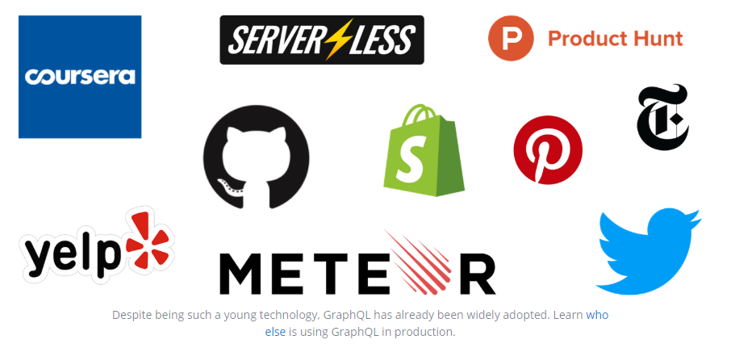
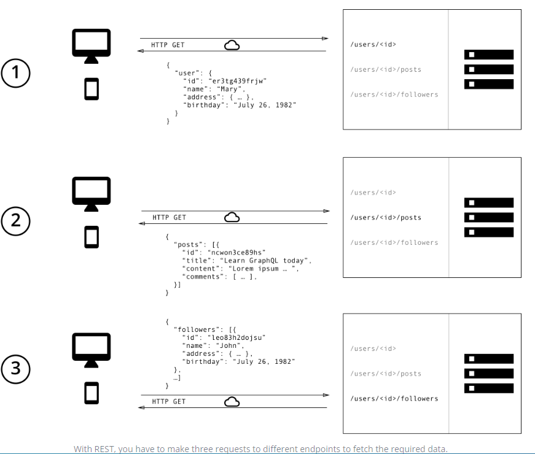
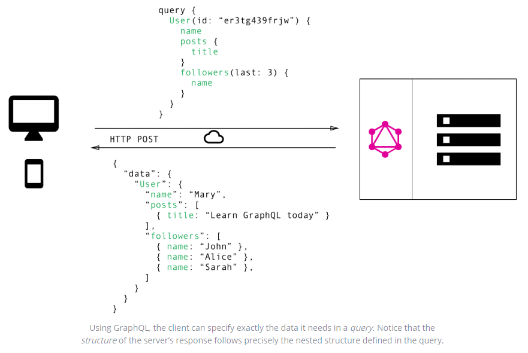

# GraphQL
## What is GraphQL
1. 它是一种新的API标准，它提供了一种更高效、强大和灵活的数据提供方式。

2. 它是由Facebook开发和开源，目前由来自世界各地的大公司和个人维护。

3. GraphQL 对你的 API 中的数据提供了一套易于理解的完整描述，使得客户端能够准确地获得它需要的数据，而且没有任何冗余。

### GraphQL的发展历史

* Facebook从2012年开始在其本地移动应用程序中使用GraphQL。不过，有趣的是，GraphQL主要用于web技术上下文中，在本地移动领域只获得了很少的吸引力。

* Facebook第一次公开谈论GraphQL是在2015年的React.js Conf大会上，当时Facebook刚刚宣布了开源计划。因为Facebook总是在React上下文中谈论GraphQL，所以非React开发人员花了一段时间才明白GraphQL绝不是一种仅限于React使用的技术。

* GraphQL是一种客户端与API服务器通信技术。有趣的是，Netflix和Coursera等其他公司也有类似想法的研究，以提高API交互的效率。Coursera设想了一种类似的技术，让客户端指定自己的数据需求，Netflix甚至开源了他们的解决方案Falcor。在GraphQL开源之后，Coursera完全取消了自己的努力，转而加入了GraphQL的行列。

* 如今，GraphQL被许多不同的公司使用在生产中，例如GithHub、Twitter、Yelp和shopif等等。



## How it works

1. hello world
```
type Query {
  hello: String
}
```

```
{
  hello: () => {
    return 'Hello world!';
  },
};
```


```
{ hello }
```

* npm start hello_world


2. 基本类型
```
type Query {
  quoteOfTheDay: String
  random: Float!
  rollThreeDice: [Int]
}
```

```
{
  quoteOfTheDay
  random
  rollThreeDice
}
```

* npm start basic_types

3. 参数传递
```
type Query {
  rollDice(numDice: Int!, numSides: Int): [Int]
}
```

```
{
  rollDice(numDice: 3, numSides: 6)
}
```

* npm start passing_arguments

4. 对象类型
```
type RandomDie {
  numSides: Int!
  rollOnce: Int!
  roll(numRolls: Int!): [Int]
}

type Query {
  getDie(numSides: Int): RandomDie
}
```

```
{
  getDie(numSides: 6) {
    rollOnce
    roll(numRolls: 3)
  }
}
```
* npm start object_types

5. mutations（创建、修改）
```
input MessageInput {
  content: String
  author: String
}

type Message {
  id: ID!
  content: String
  author: String
}

type Query {
  getMessage(id: ID!): Message
}

type Mutation {
  createMessage(input: MessageInput): Message
  updateMessage(id: ID!, input: MessageInput): Message
}
```

```
mutation {
  createMessage(input: {
    author: "andy",
    content: "hope is a good thing",
  }) {
    id
  }
}
```

* npm start mutations

## Why use
1. Data Fetching with REST vs GraphQL

* 
* 

* 不会有 Over- and Underfetching

> overfetch意味着客户端下载的信息比应用程序中实际需要的要多。在REST API中，这个应用程序通常会命中/users端点并接收一个包含用户数据的JSON数组。然而，这个响应可能包含关于返回用户的更多信息，例如他们的生日或地址——这些信息对客户端来说是无用的，因为它只需要显示用户的名字。


> underfetching 和 n+1 请求问题。Underfetching通常意味着特定端点不能提供足够的所需信息。客户端将不得不发出额外的请求来获取它需要的所有东西。这可能会升级为这样一种情况:客户机首先需要下载元素列表，然后需要为每个元素发出一个额外的请求来获取所需的数据。例如，考虑相同的应用程序还需要显示每个用户的最新的三个关注者。API提供额外的接口 /users/{user-id}/followers。为了能够显示所需的信息，应用程序必须先请求/users接口，然后为每个用户加载/users/{user-id}/followers。

2. 前端产品快速迭代

> REST API的一个常见模式，是根据APP的设计图来设计接口的。这很方便，因为它允许客户端通过访问相应的接口来获得特定页面所需的所有信息。

> 这种方法的主要缺点是它不支持前端的快速迭代。对于UI所做的每一个更改，都存在一个高风险，即现在所需的数据比以前更多(或更少)。因此，后端也需要进行调整，以适应新的数据需求。这降低了生产效率，并显著降低了将用户反馈整合到产品中的能力。

> 使用GraphQL，这个问题就解决了。由于GraphQL的灵活性，客户端上的更改无需在服务器上做任何额外的工作。由于客户端可以指定他们确切的数据需求，所以当前端的设计和数据需求发生变化时，后端工程师不需要进行调整。

3. 后端细粒度的统计

> GraphQL允许您对后端请求的数据有细粒度的了解。由于每个客户机都精确地指定了它感兴趣的信息，因此可以深入了解可用数据的使用方式。这可以为开发API提供参考，deprecate任何客户端不再请求的字段。

> 使用GraphQL，还可以对服务器处理的请求进行低级别性能监视。GraphQL使用resolver函数的概念来收集客户机请求的数据。检测这些resolver的性能可以提供关于系统瓶颈的重要见解。

4. 模型和类型系统的优点

> GraphQL使用一个强类型系统来定义API的功能。API中暴露的所有类型都会使用 GraphQL Schema Definition Language (SDL)在Schema中记录下来。Schema充当客户端和服务器之间的契约，以定义客户端如何访问数据。

> 一旦定义了Schema，前端和后端团队就可以在没有进一步沟通的情况下完成工作，因为他们都知道通过网络发送的数据的明确结构。

> 前端团队可以通过模拟所需的数据结构轻松地测试他们的应用程序。一旦服务器启动。准备好后，可以翻转开关，让客户端应用程序从实际API加载数据。